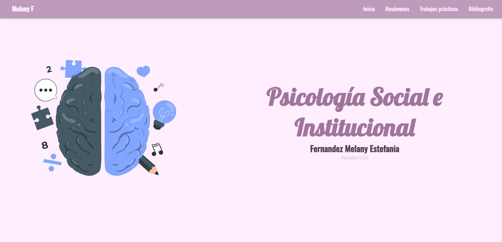
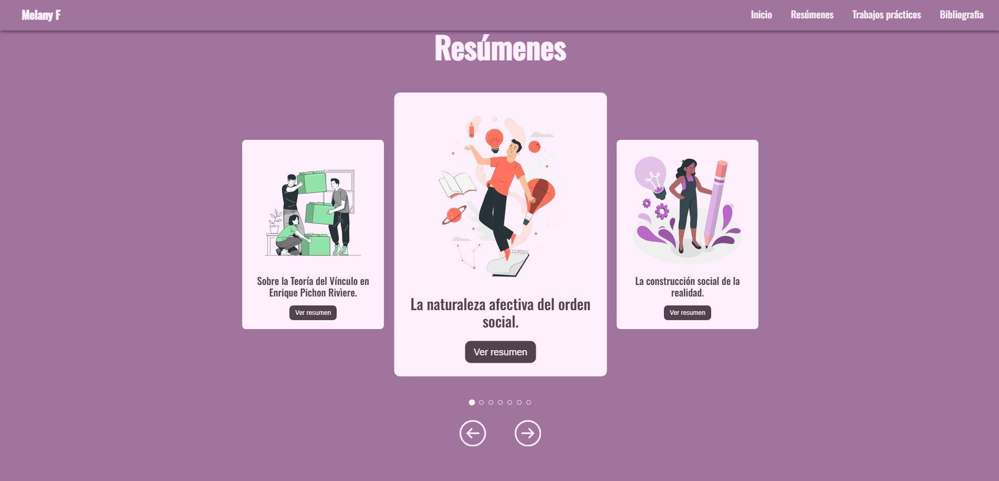
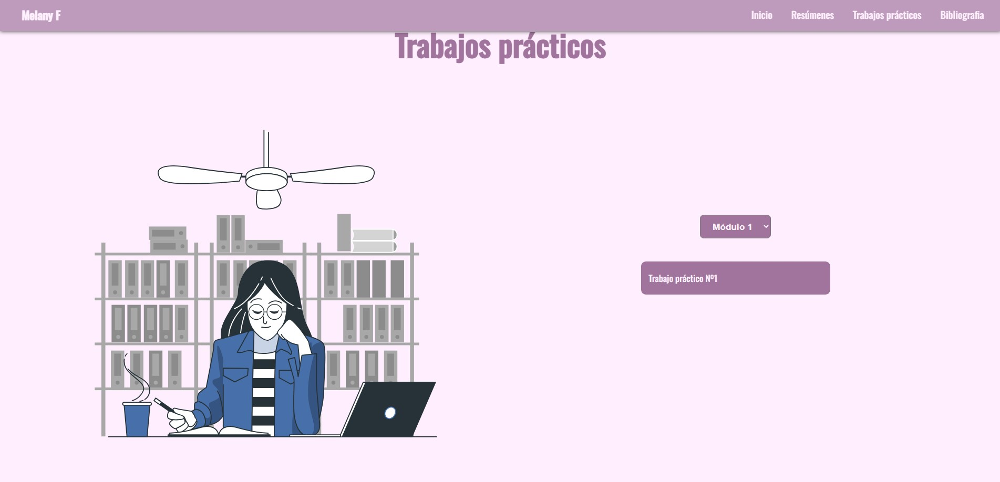

# Portafolio - psicologia social e institucional
Portafolio personal desarrollado para la asignatura Psicología Social e Institucional, correspondiente a la carrera de Educación Inicial. Se incluyen trabajos prácticos, resúmenes y bibliografias de los textos.

## Objetivos 🎯
Organizar y presentar los contenidos abordados durante la materia.

Demostrar el proceso de aprendizaje a través de resúmenes y producciones propias.

Aplicar conceptos de la psicología social al contexto educativo inicial.

Incorporar herramientas digitales para la presentación visual del contenido académico.

## Uso / Configuración

Actualmente el proyecto utiliza información estatica dentro de los archivos texts.js y practiceWorks.js.

Ejemplo para los resúmenes (Los componentes Card, Summary y References comparten el uso de los siguientes datos)

```js
const texts = [
  {
    id: 1,
    title: "texto",
    author: "texto",
    bibliography: "link",
    summary: "texto",
    image: path,
    genially: "link"
  }
]
```

Ejemplo para los trabajos prácticos

```js
export const units = [
    "Unidad 1"
]

export const practiceWorks = [
    {
        unit: "Unitdad 1",
        title: "texto",
        link: "link"
    }
]
```
La lista units determina la cantidad de opciones del elemento select.

La lista de objetos practiceWorks provee los datos de los trabajos prácticos. En este caso, los trabajos prácticos no se muestran dentro del proyecto, sino que apuntan a otro sitio web.

Para que los trabajos prácticos se desplieguen correctamente, deben tener como unidad (unit) alguna de las declaradas en la lista.

## Tecnologias
 


## Screenshots







